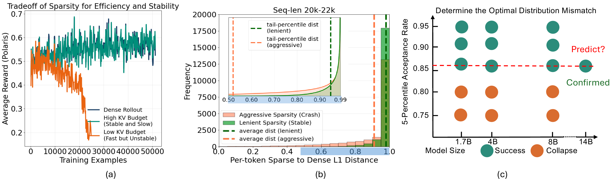
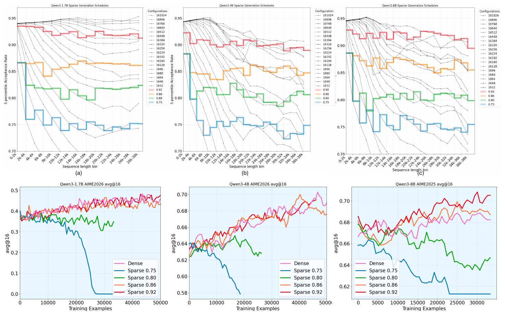
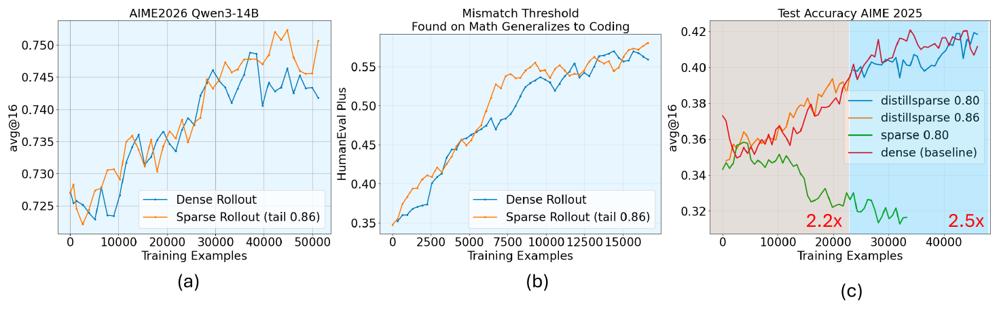

<!-- <h1 align="center">Sparrow: \underline{Spar}se \underline{Roll}out for Stable and Efficient Long-context RL of Large Language Models</h1>  --> 
<h1 align="center">
Sparrow: <u>Spar</u>se <u>Roll</u>out for Stable and Efficient Long-context RL of Large Language Models
</h1>

<p align="center">
  <b>Yang Zhou</b><sup>1</sup>, <b>Ranajoy Sadhukhan</b><sup>1</sup>, <b>Zhaofeng Sun</b><sup>2</sup>, <b>Zhuoming Chen</b><sup>1</sup>, <b>Souvik Kundu</b><sup>3</sup>, <b>Saket Dingliwal</b><sup>4</sup>, <b>Sai Muralidhar Jayanthi</b><sup>4</sup>, <b>Aram Galstyan</b><sup>4</sup>, <b>Haizhong Zheng</b><sup>1</sup>, <b>Beidi Chen</b><sup>1</sup>
</p>

<p align="center">
  <sup>1</sup>Carnegie Mellon University &nbsp;&nbsp; <sup>2</sup>Independent Researcher &nbsp;&nbsp; <sup>3</sup>Intel &nbsp;&nbsp; <sup>4</sup>Amazon AGI 
</p>

<p align="center">
  <a href="https://arxiv.org/abs/2606.08446"></a>
  &nbsp;
  <a href="https://infini-ai-lab.github.io/tamed_sparsity_release/"></a>
</p>

---

<p align="center">
  
</p> 

<p align="center">
  <a href="assets/2603.08640.mp4">Watch the Sparrow demo video</a>
</p>

Despite being powerful, **reinforcement learning with verifiable rewards (RLVR)** induces **extremely long
COT**, thus making it **highly computationally expensive**. Since RLVR per-step training cost is dominated
by **long-context generation in rollout**, sparse attention offers a promising way to accelerate dense rollout
generation. However, using sparse rollouts in practice requires a **delicate stability-efficiency tradeoff** -
either sparsity overly aggressive leading to **collapse** or overly lenient for **insufficient speedup**. 

In this work,
we study the optimal RL stability-efficiency tradeoff through the lens of **sparse-to-dense actor-policy
mismatch**. We first observe that **sparse rollout collapse is not driven by uniform degradation
across all tokens**: most tokens by sparse align with dense perfectly even under aggressive sparisty.
Motivated by the observation, we hypothesize that sparse rollout training remains stable as long as
the **lower tail of the per-token actor-policy mismatch** is kept above a **critical threshold** throughout the
sparse rollout trajectory. Then, we introduce a **dynamic sparsity scheduling** technique maintains
this tail statistic constant throughout generation and **empirically validate our hypothesis**. 

Surprisingly,
across a range of model sizes in Qwen3 thinking family, keeping the tail distribution mismatch statistics
a roughly consistent threshold generally enables **stable training**. We then use a cost-model analysis to
find the a sparsity scheduling for maximum speedup under mismatch threshold, thus achieving **2.2x,
2.4x, and 2.0x in rollout** when training **Qwen3-1.7B, Qwen3-4B, Qwen3-8B**. Empirically, we show the
identified thresholds generalize to much larger model size (**Qwen3-14B**) and other RL domain (**Coding**)
and enables stable training. Additionally, our analysis naturally motivates the technique **DistillSparse**.
Through lightweight **LoRA-based distillation** directly on sparse rollout, far more aggressive sparsity can
now attain the same sparse-to-dense mismatch threshold, thus achieving **higher speedup**. 

--- 
### Why Tail Statistics is a Better Metrics for Evaluating Sparse Dense Actor-Policy Mismatch than Average Statistics? 

We observe that **sparse rollout collapse is not driven by uniform degradation across all tokens**: even under aggressive sparsity, most generated tokens stay nearly aligned with the dense policy, and the unstable signal appears only in the **small fraction of tokens where sparse and dense behavior diverge**. As shown in Figure 1(b), the **per-token mismatch distribution is highly skewed**, so the **average mismatch becomes a weak stability indicator**. For example, when training **Qwen3-1.7B with a 37K generation budget**, a **KV budget of 4096 remains stable while 2560 collapses**, yet their average per-token sparse-dense L1 distances are nearly indistinguishable (**0.977 vs. 0.968**). We therefore evaluate mismatch with **lower-tail statistics**--the **lower 5-percentile per-token L1 distance**--which targets the **worst-aligned tokens that actually drive collapse** while ignoring the many near-perfect tokens that do not. 

--- 
### Methodology 

<p align="center">
  
</p> 

There is one main challenge to conduct systematic study of sparse dense mismatch and training stability. Under any fixed sparsity budget, the distribution mismatch always deteriorates as the generation length increases. 

We introduce the technique of sparsity scheduling, which uses a more lenient sparsity budget as generation length increases to keep the per-token mismatch approximately constant throughout generation, more details in the paper. With sparsity scheduling and ability of hold the sparse dense Actor-Policy mismatch constant throughout the trajectory, we study the relationship between the target mismatch threshold and training stability. Surprisingly, we make the following finding.

**Takeaway**: across a range of model sizes in Qwen3 thinking family, we find that keeping 5-percentile mismatch threshold above 0.86 generally leads to stable RL training, supporting our hypothesis. It supports that our hypothesis holds. 

---
### Empirical Evaluation 

<p align="center">
  
</p>

We further test our hypothesis in settings where exhaustive grid search is impractical due to limited compute. By holding the tail sparse-dense mismatch threshold at 0.86, we are able to stably train the Qwen3-14B model for a full epoch on Polaris, reaching performance on par with dense rollout. This setting is especially challenging because dense training would normally require roughly 8 days (190 hours) on a 4-node, 32-GPU H200 cluster.

Beyond math reasoning RL, we also verify that the same threshold transfers to coding RL. Specifically, we train the Qwen3-1.7B thinking model for a full epoch on TACO while maintaining the 0.86 threshold, and observe that both average reward and downstream performance remain on par with dense rollout. More details presented in paper. 

**Table 2.** Throughput and speedup from dynamic sparsity scheduling, benchmarked on 4×H200 GPUs.

| Model | Dense t. (tokens/s) | Sparse t. (tokens/s) | Rollout Speedup | RL One-step Speedup |
| :--- | :---: | :---: | :---: | :---: |
| Qwen3-1.7B (0.86) | 2561 | 5662 | 2.21× | 1.97× |
| Qwen3-4B (0.86) | 1369 | 3308 | 2.41× | 2.11× |
| Qwen3-8B (0.86) | 1300 | 2682 | 2.06× | 1.81× |
| Qwen3-14B (0.86) | 1544 | 2289 | 1.49× | 1.35× | 

--- 
### Code Organization 

```
TamedSparsity/
├── verl/            # RL training framework (sparse-rollout GRPO trainer)
├── sglang/          # Inference engine for sparse-attention rollout generation
├── vortex_torch/    # Sparse-attention CUDA kernels and Python bindings
├── examples/        # End-to-end example scripts
│   ├── data_preprocess/   # Dataset preparation
│   └── grpo_trainer/      # Training launch scripts
└── assets/          # Figures used in this README
```

Our RL training framework is built on top of [**verl**](https://github.com/volcengine/verl) and with some reference of [**code-r1**](https://github.com/ganler/code-r1) for running coding RL, then extended to support sparse-attention rollout. 

In the bigger picture sense, we build the proposed **dynamic sparsity scheduling** on top of [**vortex_torch**](https://github.com/Infini-AI-Lab/vortex_torch), then in order to support sglang integration of the sparse attention inference kernels, we add the support inside `sglang/python/sglang/srt/layers/attention/vtx_graph_backend.py`. 

For alternative development and support of newly added sparse attention kernels, feel free to copy what we do and initialize a new attention api under `sglang/python/sglang/srt/layers/attention/`. 

--- 
### Installation 
The installation of our repo can be tricky, but we have tested extensively that once the following rules are followed, the installation shouldn't hit issues. 

- Currently, we only support Hopper machines with sm100 (We will add support for Blackwell very soon). 
- `python>=3.12` is required, otherwise it is really difficult to complete the installation. 

```
bash -x master_installation_guide.sh 
``` 

For running code RL, besides of above, we also recommend installing the sandbox `firejail`. (Although if you cannot install firejail due to your system limitations, we also provide a soft-sandbox environment to bypass the requirements). 

```
sudo apt update 
sudo apt install firejail 
``` 

--- 
### Data Preprocessing 
We prepare the data preprocessing scripts under `examples/data_preprocess/process.sh`, if you want to add more train/val datasets, please copy us and add your part based on your need. 

The processed datasets are by default under `examples/data_preprocess/data/` 
```
cd examples/data_preprocess 
bash -x process.sh 
``` 

--- 
### Training Runs 
We provide both the math training RL and code RL. You can easily customize across special datasets/models of will. 

First, for the math GRPO, 
```
cd examples/grpo_trainer 
bash -x example_math.sh 
``` 
Notice that the key block are as follows 
```
+actor_rollout_ref.rollout.engine_kwargs.sglang.attention_backend='flashinfer' \
+actor_rollout_ref.rollout.engine_kwargs.sglang.disable_cuda_graph=False \
+actor_rollout_ref.rollout.engine_kwargs.sglang.vortex_module_name='block_sparse_attention' \
+actor_rollout_ref.rollout.engine_kwargs.sglang.disable_overlap_schedule=True \
+actor_rollout_ref.rollout.engine_kwargs.sglang.enable_vortex_sparsity=True \
+actor_rollout_ref.rollout.engine_kwargs.sglang.vortex_block_reserved_bos=1 \
+actor_rollout_ref.rollout.engine_kwargs.sglang.vortex_block_reserved_eos=2 \
+actor_rollout_ref.rollout.engine_kwargs.sglang.vortex_layers_skip=[0,1] \
+actor_rollout_ref.rollout.engine_kwargs.sglang.vortex_schedule_policy='qwen3-4b-0.92' \
``` 
Currently, we only support `flashinfer` for actual attention computation (`vortex` is for landmark and Top-K). Please make sure to set `vortex_module_name` to `block_sparse_attention`. You can adjust `vortex_schedule_policy` based on your model and your will. To add new schedule, you need to modify `vortex_torch/vortex_torch/indexer/utils_sglang.py`. 

To disable sparse rollout and run dense rollout, you can override the above by `actor_rollout_ref.rollout.sparse_rollout=False`. 

Similarly, for code, 
```
cd examples/code-r1 
bash -x example_code.sh 
``` 

An important thing is that if you successfully installed `firejail`, you need to turn the following on: `trainer.check_mode=firejail`, otherwise, on: `trainer.check_mode=soft`. 

--- 
### Cite US
If you find the resources provided helpful, please consider citing us 

```
@misc{zhou2026sparrowsparserolloutstable,
      title={Sparrow: Sparse Rollout for Stable and Efficient Long-context RL of Large Language Models}, 
      author={Yang Zhou and Ranajoy Sadhukhan and Zhaofeng Sun and Zhuoming Chen and Souvik Kundu and Saket Dingliwal and Sai Muralidhar Jayanthi and Aram Galstyan and Haizhong Zheng and Beidi Chen},
      year={2026},
      eprint={2606.08446},
      archivePrefix={arXiv},
      primaryClass={cs.LG},
      url={https://arxiv.org/abs/2606.08446}, 
}
```
